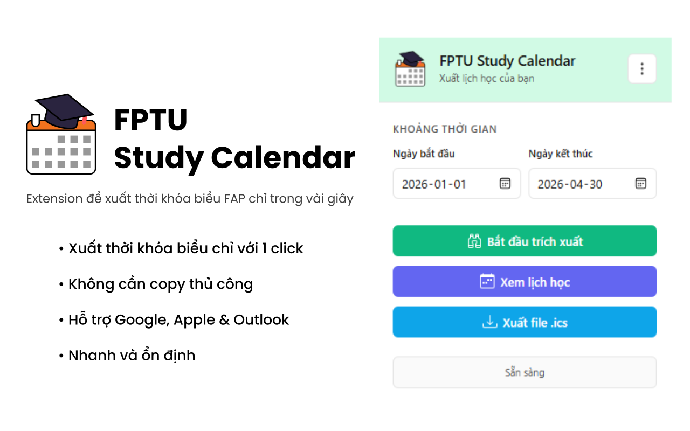

# FPTU Study Calendar

A Chrome extension that helps FPT University students export their class schedules from FAP to Google Calendar, Apple Calendar, and other calendar applications.

## 🌟 Features

- **📅 Automatic Schedule Extraction**: Extracts your class schedule from FPTU FAP website
- **👀 Visual Calendar Preview**: View schedule in week or list view with color-coded classes
- **📤 Export to ICS Format**: Export to `.ics` file for Google Calendar, Apple Calendar, Outlook, etc.
- **🌐 Online/Offline Support**: Distinguishes between online and offline classes
- **🔗 Quick Access Links**: Direct links to Google Meet, course materials (FLM), and EduNext
- **✏️ Edit Classes**: Modify class details directly in the calendar view
- **🔔 Smart Reminders**: Automatic reminders in exported calendar (15 min for online, 30 min for first offline class)

## 📦 Installation

### Method 1: Chrome Web Store (Recommended)

*Coming soon - The extension will be available on the Chrome Web Store*

### Method 2: Manual Installation (Developer Mode)

1. Clone or download this repository
2. Open Chrome and go to `chrome://extensions/`
3. Enable "Developer mode" (top-right toggle)
4. Click "Load unpacked" and select the extension folder
5. The extension icon will appear in your Chrome toolbar

## 🚀 How to Use

1. **Log in to FAP**: Navigate to [FPTU FAP](https://fap.fpt.edu.vn) and log in with your student credentials
2. **Open Extension**: Click the FPTU Study Calendar icon in your Chrome toolbar
3. **Set Date Range**: Select start and end dates (end date auto-adjusts to 3 months ahead)
4. **Extract Schedule**: Click the extraction button and wait for extraction to complete
5. **Preview**: Click the preview result button to view your schedule in week or list view
6. **Export**: Click the export button to download the calendar file, then import it into Google Calendar, Apple Calendar, or Outlook

https://github.com/user-attachments/assets/a1fb4771-dc30-4cf7-94c3-68564c58bb43

## ⚙️ Settings

Click the three-dots icon (⋮) in the extension popup to access:
- **Theme**: System, Light, or Dark
- **Wait Time**: Delay between page loads (default: 3000ms). Increase if you experience timeout errors.

## 📝 Notes

- Requires login to FAP before extraction
- Extraction time depends on date range
- Data stored locally (no external servers)
- If extraction fails, increase wait time in settings

## 🛠️ For Developers

### Project Structure

- `manifest.json` - Chrome Extension v3 manifest
- `background.js` - Service worker for scraping workflow
- `content.js` - Content script for extracting data from FAP pages
- `popup.html/js` - Extension popup UI and logic
- `calendar.html/js` - Calendar preview page
- `ics-export.js` - ICS file generation utilities
- `_locales/vi/messages.json` - Vietnamese localization

### Development

1. Clone repository and load in Chrome (`chrome://extensions/` with Developer mode enabled)
2. Debug: Background script via Service Worker inspector, content script via FAP page DevTools, popup via right-click → Inspect
3. Key files to modify:
   - `content.js`: `extractScheduleData()` function
   - `background.js`: Navigation and week iteration logic
   - `calendar.js`: View rendering and features
   - `ics-export.js`: Event generation

## 🤝 Contributing

Contributions are welcome! 🎉
Feel free to submit a pull request or open an issue with suggestions or improvements.

---

*This extension is not officially affiliated with FPT University. It is a community project for students.*
